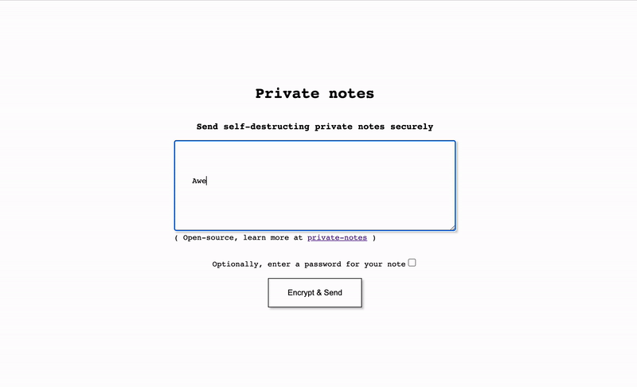

# Private Notes - send self-distructing notes over the internet

Send private notes over the internet as one time links that destroy themselves after they are read.


Or password protect your notes



clone this repository and run ./deploy.sh with two parameters, project id and region, in a shell environment where g cloud is configured and have elevated privileges over that project.
```bash
./deploy.sh {project-id} {region}
```

this will create:
- cloud function with go116 runtime providing the logic of
    - encryption at browser level
    - sending data
    - retrieving data and deleting it
- bucket for saving data
- service account for running the function
- binding above SA to bucket

# Run locally

Check contents of `local.sh` 

# Known bugs
- the deploy.sh script creates a binding for the SA to have storage admin over the bucker. This does not work properly and must be address in the gcp console.
# Further improvements
- [x] make decryption by choice, with "view note" button
- [x] add custom password
- [x] refactor html with layout
- [ ] refactor code
- [ ] make config.yaml for easier app behaviour tweaks and branding
- [ ] enable easy custom branding
- [ ] add copy to clipboard button for secret link
