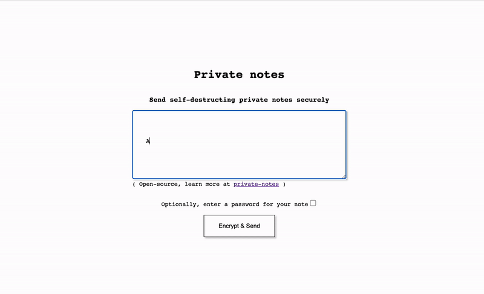

# Private Notes - send self-distructing notes over the internet



Send private notes over the internet as one time links that destroy themselves after they are read.

clone this repository and run ./deploy.sh with two parameters, project id and region, in a shell environment where g cloud is configured and have elevated privileges over that project.
```bash
./deploy.sh {project-id} {region}
```

this will create:
- cloud function with go116 runtime providing the logic of
    - encryption at browser level
    - sending data
    - retrieving data and deleting it
- bucket for saving data
- service account for running the function
- binding above SA to bucket

# Run locally

Check contents of `local.sh` 

# Known bugs
- the deploy.sh script creates a binding for the SA to have storage admin over the bucker. This does not work properly and must be address in the gcp console.
- if you pass the link through a channel that performs an ajax request on it, it will self destruct before the other person opens it
# Further improvements
- [x] make decryption by choice, with "view note" button
- [ ] add custom password
- [ ] refactor code
- [ ] refactor html with layout
- [ ] enable easy custom branding
