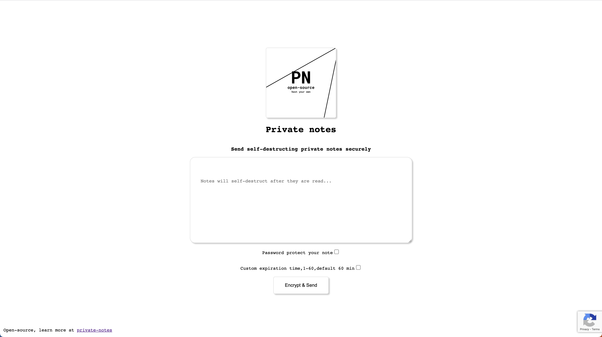

# Private Notes - send self-distructing notes over the internet



Send private notes over the internet as one time links that destroy themselves after they are read. Optionally chose a password for your note.

This app wishes to provide an open-source alternative for managed solutions of similar usecase. Advantages include being able to save the contents of messages on your organization's own cloud resources and possibility for custom branding.

Demo: https://private-notes.glavan.tech/

# Deployments

The application uses environment variables for configuration.
Use the `docker/docker-compose-example.yml` as an example to run it out of the box. Copy the `.env.dist` into a new `.env`, and start filling out the variables.

```bash
# recaptcha logic is mandatory, you have to generate a recatpcha key from google
RECAPTCHA_KEY=
RECAPTCHA_SECRET=
# if you are using the default docker compose, leave them as they are, otherwise fill in your redis variables
REDIS_HOST=redis
REDIS_PORT=6379
REDIS_PASSWORD=
# the default expiration is how much a note should stay alive, if it hasn't been read and the user didn't set a custom expiration time
DEFAULT_EXPIRATION=3600
# the maxim expiration is how much the server should allow the user to input a custom expiration time
MAXIMUM_EXPIRATION=3600
# add a custom logo, remember this application does not serve resources, this variable will only populate the href of the logo img, thus you must either provide an url for this logo, or serve it through a proxy in front of this application
CUSTOM_LOGO=http://
# optionally add a Google Analytics id
GA_TAG=G-XYG1D4F08D
# how many characters should the server allow an encrypted note to be had, generally it should be > 1.5x NOTE_MAX_LENGTH_CLIENT
NOTE_MAX_LENGTH_SERVER=20000
# how many characters should the javascript code allow the user to input
NOTE_MAX_LENGTH_CLIENT=10000
# Lang variables that you can modify the text on each page
LANG_INDEX_TITLE="Private notes"
LANG_INDEX_SUBTITLE="Send self-destructing private notes securely"
LANG_INDEX_NOTE_PLACEHOLDER="Notes will self-destruct after they are read..."
LANG_INDEX_PASSWORD="Password protect your note"
LANG_INDEX_PASSWORD_PLACEHOLDER="enter your password"
LANG_INDEX_EXPIRATION="Custom expiration time,1-60,default 60 min"
LANG_INDEX_SEND_BUTTON="Encrypt & Send"
LANG_SUCCESS_TITLE="Thank you for using private notes"
LANG_SUCCESS_SUBTITLE="This note will self-destruct after it will be read. Click on it to copy to clipboard and send this link to the other party."
LANG_SUCCESS_TOOLTIP="Click on it to copy to clipboard"
LANG_CONFIRM_SUBTITLE="Do you want to decrypt this message now? It's contents will be lost forever"
LANG_CONFIRM_SHOW_BUTTON="Show & Destroy"
LANG_RESULT_TITLE="Thank you for using private notes"
LANG_RESULT_SUBTITLE="This note has been destroyed, below is the only copy."
LANG_RESULT_PASSWORD="This message is password protected"
LANG_RESULT_PASSWORD_PLACEHOLDER="Enter your password"
LANG_RESULT_TOOLTIP="Click on it to copy to clipboard"
LANG_ERROR_TITLE="Private notes"
LANG_ERROR_SUBTITLE="Note does not exist"
LANG_ERRORBAG_EMPTY="You can't send an empty note"
LANG_ERRORBAG_PASSWORD_REQUIRED="Secret password checked but not provided"
LANG_ERRORBAG_EXPIRATION_REQUIRED="Expiration time checked but not provided"
LANG_ERRORBAG_NOTE_TOO_LONG="Secret note is too long"
LANG_ERRORBAG_EXPIRATION_TOO_LONG="Expiration time is too long"
```

Please note that this application does not currently support resolving SSL, thus if you want to use HTTPS (and you should!) you have to use a proxy like `nginx` in front of this application that offloads SSL. This proxy could also help with serving the logo.
# Run locally

Run the docker-compose in the `docker` directory to build the image locally.
