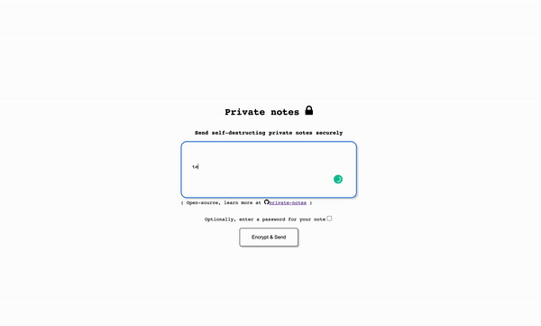

# Private Notes - send self-distructing notes over the internet

Send private notes over the internet as one time links that destroy themselves after they are read. Optionally chose a password for your note.

This repo wishes to provide an open-source alternative for managed solutions of similar usecase. Advantages include the contents of messages being saved on the organization's own cloud resources and future possibility for custom branding.

Demo: https://private-notes.glavan.tech/

# Deployments

Deployment config, coming soon.

# Run locally

Run the docker-compose in the `docker` directory

# Known bugs
- [ ] if you open a password-protected note, trying to decrypt with a wrong password will not work ( as expected ) but will also trigger the note to be destroyed. Split destroy logic, trigger with ajax
# Further improvements
- [x] make decryption by choice, with "view note" button
- [x] add custom password
- [x] refactor html with layout
- [x] refactory repository, remove cloud functions
- [x] add copy to clipboard button for secret link
- [ ] terraform code for deployment cloud run
- [ ] enable easy custom branding
- [ ] refactor code
    - [ ] implement routing
    - [ ] implement middlewares
    - [ ] implement logging
